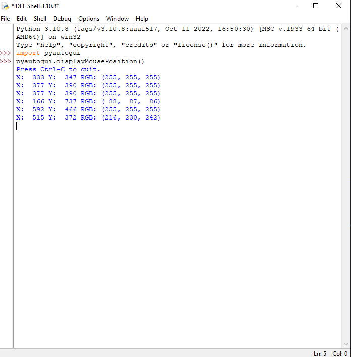

# Shiny-Bot

## Prerequisites 
In ShinyBot.py, you can use the methods to set up a bot if you provide the following information:
- Window name of game, ex: "Pokemon Insurgence"
- Non-shiny Pokemon RGB value, ex: (115, 73, 105)
- Window coordinates of what pixel you want to check. ex: (410,243)

In order to figure out out the RGB value and window coordinates for the bot to check, open the idle shell in python and write the following:
- import pyautogui
- pyautogui.displayMousePosition()

  

